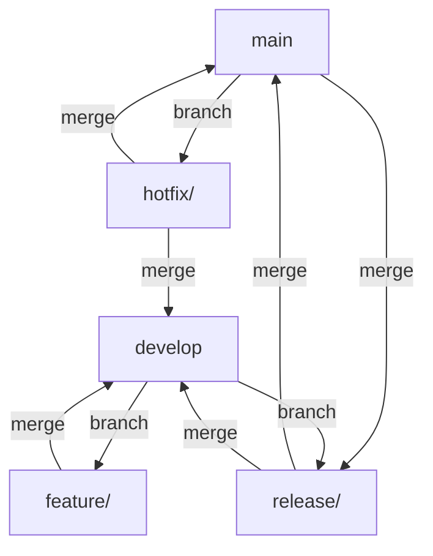

# woworld

---

## Monorepo Structure

This repository is organized as a monorepo containing two main applications:

- `client/` – Next.js frontend
- `server/` – NestJS backend

All development and version control is managed from the root of the repository.

---

## Git Flow: Branching Model & Workflow

We use **Git Flow** to organize our development process. Git Flow provides a robust branching model for managing features, releases, and hotfixes in a collaborative environment.

### Branches
- **main**: Production-ready code. Only stable releases are merged here.
- **develop**: Integration branch for features. All development happens here before releases.
- **feature/**: For new features. Branch off from `develop`.
- **release/**: For preparing a new production release. Branch off from `develop`.
- **hotfix/**: For urgent fixes to production. Branch off from `main`.
- **bugfix/**: For fixing bugs before a release. Branch off from `develop`.
- **support/**: For long-term support maintenance.

### Typical Workflow
1. **Start a feature:**
   ```sh
   git flow feature start my-feature
   # work, commit, push
   git flow feature finish my-feature
   ```
2. **Start a release:**
   ```sh
   git flow release start 1.0.0
   # test, update version, etc.
   git flow release finish 1.0.0
   ```
3. **Start a hotfix:**
   ```sh
   git flow hotfix start urgent-fix
   # fix, commit, push
   git flow hotfix finish urgent-fix
   ```

### Diagram: Git Flow Branching Model



---

## References
- [Git Flow Documentation](https://nvie.com/posts/a-successful-git-branching-model/)
- [Atlassian Git Flow Guide](https://www.atlassian.com/git/tutorials/comparing-workflows/gitflow-workflow)
- [Git Flow Cheatsheet](https://danielkummer.github.io/git-flow-cheatsheet/)

---

**Team Notes:**
- Always pull the latest changes before starting new work.
- Use descriptive names for features and hotfixes.
- Keep commits atomic and meaningful.
- Ask in the team chat if you’re unsure about the workflow.
